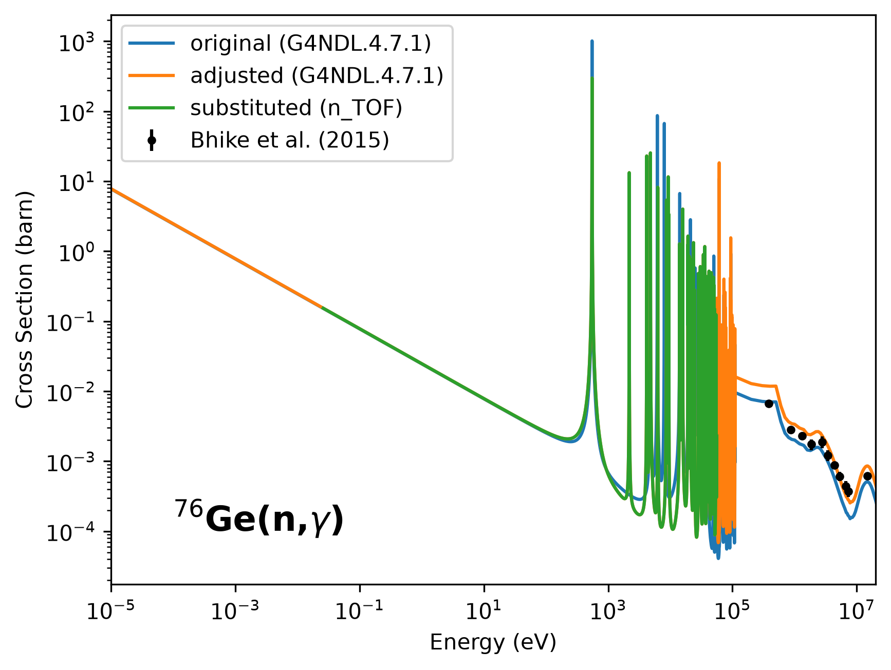

# custom-g4ndl-generator

Generate custom [G4NDL](https://geant4.web.cern.ch/) neutron-data libraries in
which selected cross sections are scaled and/or replaced with external data.
A YAML config file sets which files change and how. The rest of the library is
copied through unchanged.

The example `examples/ge76_ntof.yaml` scales the
**Ge-76 radiative-capture cross section** and replaces part of it with the
n_TOF measurement of Ge-76(n,γ)
([Phys. Rev. C **104**, 044610](https://journals.aps.org/prc/abstract/10.1103/PhysRevC.104.044610)).
These libraries are used for Ge-77(m) production studies in LEGEND
(see [legend-simflow#265](https://github.com/legend-exp/legend-simflow/issues/265)).

## Install

```bash
pip install -e .
```

## Usage

```
custom-g4ndl CONFIG.yaml [--source <NAME|URL|dir|tarball>] [--output DIR] [options]
```

### Config file

```yaml
source: JEFF-3.3          # any command-line option, without the leading "--"
output: ./out
base-library: G4NDL.4.7.1

customization:            # G4NDL folder layout, names as in the library
  Capture:
    CrossSection:
      32_76_Germanium:            # selects 32_76_Germanium or 32_76_Germanium.z
        scale: 1.68                 # multiply sigma (default 1.0)
        substitute: 76GE_XS.yaml    # YAML file, relative to the config file
      32_74_Germanium:
        substitute:                 # or in-line (E [eV], sigma [barn]) pairs
          - [0.0257, 0.154]
          - [52000.0, 0.012]
```

* Options on the **command line override** the same keys in the config file.
* Folder and file keys are the names in the G4NDL library
  (`Capture/CrossSection/32_76_Germanium`).
* The `.z` suffix of the file name is optional. The key selects the plain file
  (e.g. JEFF-3.3) and the compressed file (e.g. G4NDL 4.7.1).
* Only `CrossSection` files can be adjusted. Other folders (`FS`, `F01`, ...)
  have a different data format.
* A substitution file is a YAML file with the same list of `[E, sigma]`
  pairs as the in-line form (see `examples/76GE_XS.yaml`).

### Library source

The `source` can be:

* a **G4NDL library name**, downloaded from
  `https://cern.ch/geant4-data/datasets/<NAME>.tar.gz`
  (e.g. `G4NDL.4.5`, `G4NDL.4.7.1`),
* an **IAEA library name**, downloaded from
  `https://nds.iaea.org/geant4/libraries/<NAME>.tar.gz`
  (e.g. `JEFF-3.3`, `ENDF-VIII.0`, `JENDL-4.0u`, `ENDF-B-VIII.1`, `JENDL-5.0`),
* a full `https://…` URL to such a `.tar.gz`,
* a local `.tar.gz` / `.tgz` / `.tar` archive, or
* an already-extracted library **directory**.

Examples:

```bash
# Ge-76 template as it is: JEFF-3.3, scale 1.68 + n_TOF substitution
custom-g4ndl examples/ge76_ntof.yaml

# Same adjustment on a library you already have on disk
custom-g4ndl examples/ge76_ntof.yaml --source /data/G4NDL4.7 --output ./out
```

Each run writes `DIR/<name>/` (the modified library, directly usable by Geant4).
With `--tarball` it also writes `DIR/<name>.tar.gz`. Point Geant4 at the directory via the neutron-HP data
environment variable `G4NEUTRONHPDATA`.

### Options

| Option | Description |
| --- | --- |
| `--source SOURCE` | Library to start from (see above). |
| `--output DIR` | Output folder. |
| `--base-library SOURCE` | Full G4NDL used to fill in folders a translated library omits (default: a pinned `G4NDL.4.7.1` download). Accepts a dir / `.tar.gz` / IAEA name / G4NDL name / URL, like `--source`. |
| `--allow-incomplete` | Write the library even when the omitted folders cannot be filled in (produces a library Geant4 cannot fully use). |
| `--cache-dir DIR` | Where downloads/extractions are cached. |
| `--rename NAME` | Name of the output library directory. |
| `--tarball` | Also write `DIR/<name>.tar.gz`. |
| `--force` | Overwrite an existing output directory. |
| `-v`, `-vv` | More verbose logging. |

## What the adjustment does

With `substitute` set, for `scale: factor`:

| energy region | output `(E, σ)` |
| --- | --- |
| `E < E_min` (below the substitution range) | `(E, σ × factor)` |
| `E_min ≤ E ≤ E_max` | substitution `(E, σ)` (fully replaced, not scaled) |
| `E > E_max` | `(E, σ × factor)` |

Without `substitute`, every σ is multiplied by `factor` and the energy grid is
left unchanged.

An illustration of the effect is in `docs/examples/draw_comparison.py` (requires `matplotlib`)
with the resulting plot also shown below.



## Completing translated libraries

The IAEA-translated libraries (`JEFF-3.3`, `ENDF-VIII.0`, `JENDL-*`) are
**deliberately incomplete**: they ship only the ENDF-derived reactions
(`Capture`, `Elastic`, `Fission`, `Inelastic`) and, per their own README, must
have four folders overlaid from a full G4NDL distribution before Geant4 can use
them:

* `IsotopeProduction`,
* `JENDL_HE`,
* `ThermalScattering`,
* `Inelastic/Gammas`.

`custom-g4ndl` detects any of these that the source omits and copies them in from
a base G4NDL (`--base-library`, default: a pinned `G4NDL.4.7.1` download).
Existing library data is never overwritten — only the missing folders are filled.
If the folders are missing and no base can supply them, the run aborts
rather than emit a silently-broken library. Pass `--allow-incomplete` to override.

```bash
# JEFF-3.3, with the four missing folders overlaid from a G4NDL you have on disk
custom-g4ndl my_config.yaml --source JEFF-3.3 --output ./out --base-library /data/G4NDL4.7.1
```

## Workflow: generate a library and load it into Geant4

End-to-end, from a source library to a Geant4 run:

```bash
# 1. Generate. Writes ./out/JEFF-3.3/ (the library).
#    --base-library fills in the folders JEFF-3.3 omits (see above). Drop it to
#    use the pinned default G4NDL download instead.
custom-g4ndl my_config.yaml --source JEFF-3.3 --output ./out --base-library /data/G4NDL4.7.1

# 2. Point Geant4's neutron-HP data at the generated directory.
#    Use an ABSOLUTE path. Export it in your shell (or .bashrc, or job script).
export G4NEUTRONHPDATA="$(pwd)/out/JEFF-3.3"

# 3. Run your Geant4 application as usual. It now uses the adjusted Ge-76
#    capture cross section. Sanity-check the variable actually points at a
#    library root (should list Capture/ Elastic/ IsotopeProduction/ ...):
ls "$G4NEUTRONHPDATA"
```

Notes:

* Set the variable to the **library directory** (the one containing `Capture/`),
  not to `./out` and not to the `.tar.gz`.
* `G4PARTICLEHPDATA` is for the charged-particle data (G4TENDL). Set it only
  for a library made from `G4TENDL`.
* To deploy elsewhere, run with `--tarball`, copy the `.tar.gz`, extract it, and point the variable at
  the extracted directory.

## G4NDL cross-section format

A G4NDL `Capture/CrossSection` file is G4NDL's internal representation (not
literal ENDF-6): a small header followed by a flat stream of `(energy, σ)` pairs,
three pairs per line. Three header families are supported transparently (tab /
`G4NDL`-string / bare). Individual `.z` (zlib) compressed files are handled too.
See `src/custom_g4ndl_generator/g4ndl.py`.

## Development

```bash
pip install -e '.[dev]'   # runtime + pytest + pre-commit + black + pydocstyle
pytest

# Install the git hooks so black + documentation checks run on every commit:
pre-commit install
pre-commit run --all-files   # run them once over the whole tree
```

The hooks (`.pre-commit-config.yaml`) run [black](https://black.readthedocs.io/)
formatting and [pydocstyle](https://www.pydocstyle.org/) documentation checks
(numpy convention, package sources only), plus basic file hygiene. The same
checks and the test suite (Python 3.9–3.12) run in CI on every push and pull
request — see [`.github/workflows/tests.yml`](.github/workflows/tests.yml).
